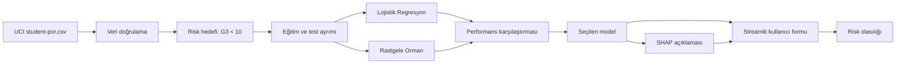

# Öğrenci Başarı Riski ve Açıklanabilir Erken Uyarı Sistemi

Bu proje, **Akademik Yapay Zekaya Giriş Bireysel Ürün Geliştirme Projesi - Seçenek 3** kapsamında hazırlanmış çalışan bir makine öğrenmesi karar destek uygulamasıdır.

> **Tanıtım videosu:** Tanıtım videosu final sürümünde bu bölüme eklenecektir.


## Problem tanımı

Öğrencilerin başarısızlık riski çoğu zaman final notu açıklandıktan sonra fark edilir. Bu ürün; dönem içi notlar, çalışma süresi, devamsızlık, geçmiş başarısızlıklar ve destek bilgilerini kullanarak final notunun 10'un altında kalma riskini önceden tahmin eder.

## Hedef kullanıcı

Öğretmenler, rehberlik birimleri ve akademik danışmanlar. Sistem otomatik karar vermek için değil, incelenmesi gereken öğrencileri erken fark etmeye yardımcı olmak için tasarlanmıştır.

## Çözümün kısa açıklaması

Kullanıcı Streamlit arayüzündeki forma öğrenci bilgilerini girer. Sistem:

1. Başarısızlık risk olasılığını hesaplar.
2. Düşük, orta veya yüksek risk seviyesi üretir.
3. Kısa bir destek önerisi sunar.
4. SHAP ile hangi özelliklerin riski artırdığını veya azalttığını açıklar.

Risk hedefi, UCI veri setindeki final notu `G3 < 10` olduğunda **riskli** olarak tanımlanmıştır. Tahmin, ikinci dönem sonunda kullanılmak üzere G1 ve G2 ara dönem notlarını da içerir.

## Veri kaynağı

- UCI Machine Learning Repository - Student Performance
- 649 öğrenci, 33 özgün sütun
- Kullanılan bölüm: Portekizce dersi (`student-por.csv`)
- DOI: https://doi.org/10.24432/C5TG7T
- Lisans: CC BY 4.0

Detaylı atıf ve bağlantılar `KAYNAKLAR.md` ile `data/README.md` dosyalarındadır.

## Kullanılan teknolojiler

- Python
- pandas ve NumPy
- scikit-learn
- SHAP
- Streamlit
- matplotlib
- pytest
- GitHub Actions

## Sistem mimarisi / iş akışı



## Veri hazırlama

- Veri dosyası noktalı virgül ayırıcıyla okunur.
- Zorunlu sütunlar doğrulanır.
- Sayısal sütunlarda medyanla eksik değer tamamlama ve standartlaştırma uygulanır.
- Kategorik sütunlarda en sık değerle tamamlama ve one-hot encoding uygulanır.
- Veri %75 eğitim ve %25 test olarak, sınıf oranını koruyacak biçimde ayrılır.
- Final hedefi model girdilerinden çıkarılır; `G3` yalnızca hedef üretmek için kullanılır.

## Model karşılaştırması

| Model | Test doğruluk | Test ROC-AUC | Risk recall | Risk F1 | Eğitim-test AUC farkı |
|---|---:|---:|---:|---:|---:|
| Lojistik Regresyon | 0.890 | 0.941 | **0.920** | **0.719** | 0.045 |
| Rastgele Orman | 0.877 | **0.944** | 0.840 | 0.677 | 0.055 |

Son model olarak **Lojistik Regresyon** seçilmiştir. Çünkü amaç riskli öğrenciyi kaçırmamak olduğundan risk sınıfı recall değeri önceliklendirilmiştir. Testte 25 riskli öğrencinin 23'ü yakalanmıştır.


## Açıklanabilirlik

SHAP, model çıktısını özellik katkılarına ayırır. Pozitif SHAP değeri başarısızlık riskini artıran, negatif değer riski azaltan etkiyi gösterir. Uygulama her tahminde en etkili özellikleri hem grafik hem tablo olarak sunar.


## Kurulum adımları

### macOS / Linux

```bash
cd final-projesi-arda-cengiz
python3 -m venv .venv
source .venv/bin/activate
pip install -r requirements.txt
python train.py
streamlit run app.py
```

### Windows

```powershell
cd final-projesi-arda-cengiz
python -m venv .venv
.venv\Scripts\activate
pip install -r requirements.txt
python train.py
streamlit run app.py
```

Tarayıcı otomatik açılmazsa terminalde görünen `http://localhost:8501` adresine girilir.

## Kullanım biçimi

1. Uygulamayı çalıştır.
2. Form alanlarını öğrencinin mevcut bilgileriyle doldur.
3. **Riski hesapla** düğmesine bas.
4. Risk olasılığını, seviyeyi ve öneriyi incele.
5. SHAP grafiğindeki özelliklerin tahmine katkısını kontrol et.

Detaylı örnek `KULLANICI-SENARYOSU.md` dosyasındadır.

## Örnek ekran görüntüleri

### Ana uygulama ve tahmin sonucu


### Test karmaşıklık matrisi


## Test sonuçları

- Test örneği: 163 öğrenci
- Test doğruluğu: %88,96
- Test ROC-AUC: 0,941
- Risk recall: %92
- Risk F1: 0,719
- Karmaşıklık matrisi: 122 doğru risksiz, 23 doğru riskli, 16 yanlış alarm, 2 kaçırılan riskli öğrenci

Otomatik testleri çalıştırmak için:

```bash
pytest -q
```

Beş kullanıcı senaryosu ve ayrıntılı değerlendirme `TEST-SONUCLARI.md` dosyasındadır.

## Bilinen sınırlılıklar

- Veri Portekiz'deki iki ortaöğretim okulundan gelmektedir; Türkiye'deki öğrenciler için doğrudan genellenemez.
- Veri setinde yalnızca 100 riskli örnek vardır; sınıf dengesizliği bulunmaktadır.
- G1 ve G2 notları modele güçlü bilgi sağlar; bu nedenle ürün ikinci dönem sonu erken uyarı aracı olarak yorumlanmalıdır.
- Model olasılığı kesin hüküm değildir ve öğretmen değerlendirmesinin yerini alamaz.
- Gerçek okul kullanımında veri gizliliği, açık rıza, erişim kontrolü ve ayrımcılık denetimi gerekir.

## Gelecekte yapılabilecek geliştirmeler

- Türkiye'den anonimleştirilmiş ve güncel okul verileriyle yeniden eğitim
- Farklı sınıf seviyeleri için ayrı modeller
- Model kalibrasyonu ve eşik ayarı
- Danışman notlarının güvenli biçimde eklenmesi
- Zaman içindeki model performansının izlenmesi

## Yapay zekâ araçlarının hangi aşamalarda kullanıldığı

ChatGPT; proje kapsamının daraltılması, kod taslağı, dokümantasyon yapısı ve test senaryolarının hazırlanmasında yardımcı araç olarak kullanılmıştır. Veri kaynağı, model sonuçları ve kod çalıştırılarak kontrol edilmiştir. Projeyi teslim eden öğrenci kodu okuyabilmeli, uygulamayı çalıştırabilmeli ve modelin sınırlılıklarını açıklayabilmelidir.

## Proje dosyaları

```text
final-projesi-arda-cengiz/
├── app.py
├── train.py
├── src/
├── tests/
├── data/
├── artifacts/
├── docs/images/
├── PROJE-ONERISI.md
├── TEST-SONUCLARI.md
├── KULLANICI-SENARYOSU.md
├── KAYNAKLAR.md
├── VIDEO-SENARYOSU.md
├── GITHUB-ISSUES.md
├── GITHUB-YUKLEME.md
└── Final_OgrenciNo_Arda_Cengiz.pdf
```

## Etik kullanım notu

Bu prototip, öğrenciye yaptırım uygulamak veya otomatik not/başarı kararı vermek için kullanılmamalıdır. Tahmin yalnızca öğretmen ya da danışmanın daha ayrıntılı inceleme yapmasına yardımcı olan bir sinyaldir.
