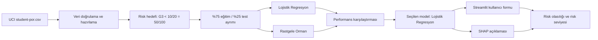

# Öğrenci Başarı Riski ve Açıklanabilir Karar Destek Sistemi

Bu proje, **Akademik Yapay Zekâya Giriş Bireysel Ürün Geliştirme Projesi – Seçenek 3** kapsamında geliştirilmiş, çalışan ve açıklanabilir bir makine öğrenmesi karar destek uygulamasıdır.

**Öğrenci:** Ahmet Arda Cengiz  
**Öğrenci numarası:** 2544001028  
**Final sürümü:** v1.0.0

> **Tanıtım videosu:** [Videoyu izlemek için tıklayın](https://youtu.be/pjEHNKvjjr0)

## Problem tanımı

Öğrencilerin akademik başarısızlık riski çoğu zaman final notu açıklandıktan sonra fark edilir. Bu uygulama; dönem içi notlar, devamsızlık, çalışma süresi, geçmiş başarısızlıklar ve destek bilgileri gibi değişkenleri kullanarak öğrencinin final notunun **50/100 altında kalma riskini** önceden tahmin eder.

UCI veri setindeki notlar 0–20 ölçeğindedir. Risk hedefi veri setinde `G3 < 10/20` olarak tanımlanmıştır; bu eşik 100’lük sistemde `50/100` değerine karşılık gelir. Uygulamada kullanıcı G1 ve G2 notlarını 100 üzerinden girer, bu değerler model için otomatik olarak 20’lik ölçeğe dönüştürülür.

## Hedef kullanıcı

- Öğretmenler
- Rehberlik birimleri
- Akademik danışmanlar
- Eğitim yöneticileri

Sistem otomatik karar vermek için değil, incelenmesi ve desteklenmesi gereken öğrencileri erken fark etmeye yardımcı olmak için tasarlanmıştır.

## Çözümün kısa açıklaması

Kullanıcı, Streamlit arayüzündeki forma öğrenci bilgilerini girer. Sistem:

1. Başarısızlık risk olasılığını hesaplar.
2. Düşük, orta veya yüksek risk seviyesi üretir.
3. Kısa bir destek önerisi sunar.
4. SHAP yöntemiyle hangi özelliklerin riski artırdığını veya azalttığını açıklar.
5. Model karşılaştırma sonuçlarını kullanıcıya gösterir.

## Veri kaynağı

Projede **UCI Machine Learning Repository – Student Performance** veri setinin Portekizce dersi bölümü (`student-por.csv`) kullanılmıştır.

- 649 öğrenci kaydı
- 33 özgün sütun
- Portekiz’deki iki ortaöğretim okulundan elde edilen veriler
- Lisans: CC BY 4.0
- DOI: [10.24432/C5TG7T](https://doi.org/10.24432/C5TG7T)

Ayrıntılı atıf ve bağlantılar [`KAYNAKLAR.md`](KAYNAKLAR.md) dosyasındadır.

## Kullanılan teknolojiler

- **Python:** Ana programlama dili
- **pandas ve NumPy:** Veri okuma, dönüştürme ve hazırlama
- **scikit-learn:** Model eğitimi, veri ön işleme ve performans değerlendirmesi
- **Lojistik Regresyon:** Seçilen tahmin modeli
- **Rastgele Orman:** Karşılaştırma modeli
- **SHAP:** Model kararlarının açıklanması
- **Streamlit:** Web tabanlı kullanıcı arayüzü
- **matplotlib:** SHAP katkı grafiği
- **pytest:** Otomatik testler
- **GitHub:** Sürüm kontrolü, Issue takibi ve final sürümünün yayımlanması

## Sistem mimarisi / iş akışı



## Veri hazırlama

- Veri dosyası noktalı virgül ayırıcıyla okunur.
- Zorunlu sütunlar doğrulanır.
- Sayısal sütunlarda eksik değerler medyanla tamamlanır ve standartlaştırma uygulanır.
- Kategorik sütunlarda eksik değerler en sık değerle tamamlanır ve one-hot encoding uygulanır.
- Veri, sınıf oranı korunarak %75 eğitim ve %25 test olarak ayrılır.
- `G3` model girdilerinden çıkarılır ve yalnızca hedef değişkeni oluşturmak için kullanılır.
- Kullanıcıdan 100 üzerinden alınan G1 ve G2 değerleri model içinde 5’e bölünerek 20’lik ölçeğe dönüştürülür.

## Model karşılaştırması

| Model | Test doğruluğu | Test ROC-AUC | Risk recall | Risk F1 | Eğitim-test AUC farkı |
|---|---:|---:|---:|---:|---:|
| Lojistik Regresyon | 0.890 | 0.941 | 0.920 | 0.719 | 0.045 |
| Rastgele Orman | 0.877 | 0.944 | 0.840 | 0.677 | 0.055 |

Son model olarak **Lojistik Regresyon** seçilmiştir. Rastgele Orman modelinin ROC-AUC değeri az miktarda daha yüksek olsa da projenin temel amacı riskli öğrencileri kaçırmamaktır. Lojistik Regresyon, riskli öğrencilerin %92’sini yakalamış ve testte 25 riskli öğrencinin 23’ünü doğru belirlemiştir.

Eğitim ve test ROC-AUC değerleri arasındaki farklar incelendiğinde iki modelde de hafif overfitting görülmektedir. Ancak farkların sınırlı olması, modellerin tamamen ezberleme yapmadığını göstermektedir.

## Açıklanabilirlik

SHAP, model tahminini her özelliğin katkısına ayırır.

- Pozitif SHAP değeri riski artıran etkiyi gösterir.
- Negatif SHAP değeri riski azaltan etkiyi gösterir.
- Uygulama, her tahminde en etkili sekiz özelliği grafik ve tablo biçiminde sunar.

Bu sayede kullanıcı yalnızca risk oranını değil, modelin bu sonuca neden ulaştığını da görebilir.

## Kurulum adımları

### macOS / Linux

```bash
git clone https://github.com/ahmetardacengiz0-cpu/final-projesi-AhmetArda-Cengiz.git
cd final-projesi-AhmetArda-Cengiz

python3 -m venv .venv
source .venv/bin/activate
python3 -m pip install -r requirements.txt

python3 train.py
python3 -m streamlit run app.py
```

### Windows

```powershell
git clone https://github.com/ahmetardacengiz0-cpu/final-projesi-AhmetArda-Cengiz.git
cd final-projesi-AhmetArda-Cengiz

python -m venv .venv
.venv\Scripts\activate
python -m pip install -r requirements.txt

python train.py
python -m streamlit run app.py
```

Tarayıcı otomatik açılmazsa terminalde gösterilen `http://localhost:8501` adresine gidilir.

## Kullanım biçimi

1. Uygulamayı çalıştırın.
2. Öğrencinin mevcut bilgilerini forma girin.
3. G1 ve G2 dönem notlarını 100 üzerinden girin.
4. **Riski hesapla** düğmesine basın.
5. Risk olasılığını, risk seviyesini ve destek önerisini inceleyin.
6. SHAP grafiği ve tablosundan özelliklerin tahmine katkısını değerlendirin.

Ayrıntılı örnek kullanım [`KULLANICI-SENARYOSU.md`](KULLANICI-SENARYOSU.md) dosyasındadır.

## Örnek ekran görüntüleri

### Öğrenci bilgi giriş ekranı


### Tahmin sonucu ve SHAP açıklaması


## Test sonuçları

- Test örneği: 163 öğrenci
- Test doğruluğu: %88,96
- Test ROC-AUC: 0,941
- Risk recall: %92
- Risk F1: 0,719
- Karmaşıklık matrisi:
  - 122 doğru risksiz tahmin
  - 23 doğru riskli tahmin
  - 16 yanlış alarm
  - 2 kaçırılan riskli öğrenci

Otomatik testleri çalıştırmak için:

```bash
python3 -m pytest -q
```

Hazırlanan beş otomatik testin tamamı başarıyla geçmiştir. Ayrıca yüksek risk, düşük risk, sınır değer ve minimum-maksimum girişleri içeren beş kullanıcı senaryosu uygulanmıştır. Ayrıntılı sonuçlar [`TEST-SONUCLARI.md`](TEST-SONUCLARI.md) dosyasındadır.

## Bilinen sınırlılıklar

- Veri Portekiz’deki iki ortaöğretim okulundan gelmektedir ve Türkiye’deki öğrencilere doğrudan genellenemez.
- Veri setinde yalnızca 100 riskli örnek bulunduğu için sınıf dengesizliği vardır.
- Model Portekizce dersi verileriyle eğitilmiştir; başka dersler için ayrıca doğrulanması gerekir.
- G1 ve G2 notları tahminde güçlü etkiye sahiptir. Bu nedenle ürün, ikinci dönem sonuna yönelik bir erken uyarı aracıdır.
- Model olasılığı kesin hüküm değildir ve öğretmen ya da danışman değerlendirmesinin yerini alamaz.
- Gerçek okul kullanımında veri gizliliği, açık rıza, erişim kontrolü ve ayrımcılık denetimi gerekir.

## Gelecekte yapılabilecek geliştirmeler

- Türkiye’den anonimleştirilmiş ve güncel okul verileriyle modeli yeniden eğitmek
- Farklı ders ve sınıf seviyeleri için ayrı modeller geliştirmek
- Risk eşiğini kurum gereksinimlerine göre ayarlamak
- Model olasılıklarını kalibre etmek
- Danışman notlarını güvenli biçimde sisteme eklemek
- Zaman içindeki model performansını izlemek

## Yapay zekâ araçlarının kullanımı

Ürünün temel yapay zekâ bileşeni, öğrenci verilerinden risk olasılığı üreten makine öğrenmesi modelidir. SHAP yöntemi ise model kararlarını açıklamak için kullanılmıştır.

ChatGPT; proje kapsamının belirlenmesi, kod taslağının hazırlanması, hata ayıklama, dokümantasyon düzeni ve test senaryolarının oluşturulması aşamalarında yardımcı araç olarak kullanılmıştır. Veri kaynağı, model sonuçları ve uygulama çalıştırılarak kontrol edilmiştir.

## Proje dosyaları

```text
final-projesi-AhmetArda-Cengiz/
├── app.py
├── train.py
├── requirements.txt
├── src/
├── tests/
├── data/
├── artifacts/
├── README.md
├── PROJE-ONERISI.md
├── KAYNAKLAR.md
├── KULLANICI-SENARYOSU.md
├── TEST-SONUCLARI.md
├── LICENSE
├── Screenshot 2026-06-16 at 11.30.51.png
├── Screenshot 2026-06-16 at 11.31.06.png
└── Final_2544001028_Ahmet_Arda_Cengiz.pdf
```

## Final raporu

Bir sayfalık final raporu:

[`Final_2544001028_Ahmet_Arda_Cengiz.pdf`](Final_2544001028_Ahmet_Arda_Cengiz.pdf)

## Etik kullanım notu

Bu prototip; öğrenciye yaptırım uygulamak, otomatik not vermek veya tek başına başarı kararı oluşturmak amacıyla kullanılmamalıdır. Tahmin, öğretmen veya danışmanın daha ayrıntılı inceleme yapmasına yardımcı olan bir karar destek sinyalidir.

## Lisans

Proje kodu [`LICENSE`](LICENSE) dosyasında belirtilen MIT Lisansı ile paylaşılmıştır. Kullanılan UCI veri seti CC BY 4.0 lisansına tabidir.
